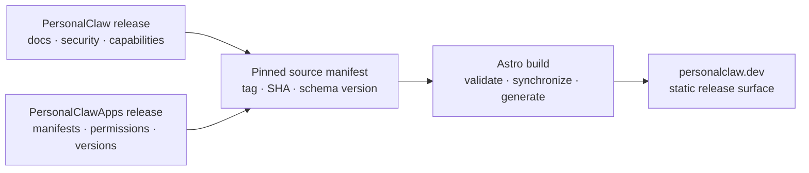

<p align="center">
  
</p>

<h1 align="center">personalclaw.dev</h1>

<p align="center">
  <strong>The public product, documentation, security, installation, and ecosystem surface for PersonalClaw.</strong>
</p>

<p align="center">
  <a href="https://personalclaw.dev">Website</a>
  ·
  <a href="https://github.com/PersonalClaw/PersonalClaw">Core</a>
  ·
  <a href="https://github.com/PersonalClaw/PersonalClawApps">First-party apps</a>
  ·
  <a href="./docs/roadmap/roadmap.md">Roadmap</a>
</p>


## What This Repository Is

This repository contains the source for [personalclaw.dev](https://personalclaw.dev), the public release interface for PersonalClaw.

It has a broader job than a conventional marketing site:

- Show the real product through real, reproducible captures.
- Explain how chat, goal loops, memory, knowledge, automation, and apps fit together.
- Make the ownership, trust, and permission boundaries understandable.
- Publish documentation and installation paths tied to verifiable releases.
- Represent the first-party app ecosystem without duplicating its source of truth.
- Help operators and builders evaluate the project without tracking them.

The website should be persuasive because it is specific and checkable, not because it hides the product's maturity or tradeoffs.

> [!IMPORTANT]
> The current codebase is the initial pre-release website implementation. Its marketing routes and visual system are functional, but release-pinned content synchronization, canonical `/docs`, and the production `/install` contract are roadmap work. A package version or branch snapshot must not be presented as a tagged PersonalClaw release.

## Experience Map

| Route | Purpose |
|---|---|
| `/` | Product thesis, system overview, ecosystem proof, security posture, and source quickstart |
| `/product` | Guided tour of chat, autonomous goals, memory, knowledge, automation, and agent runtimes |
| `/apps` | Searchable first-party app directory and app-platform explanation |
| `/security` | Trust boundaries, enforced controls, supply-chain lifecycle, and known limitations |

The next major public surfaces are synchronized documentation, release provenance, stable installation, changelog, and app detail routes. Their sequencing and acceptance gates are defined in the [website evolution roadmap](./docs/roadmap/roadmap.md).

## Product Principles

### Show the product

Product captures carry the argument. The site does not use fabricated dashboards, generic AI illustrations, or abstract decoration where an actual interface can explain the capability.

### Publish release truth

Production copy must describe tagged, reproducibly released behavior. Product capabilities, version numbers, security controls, platform support, app metadata, and install methods should be generated or synchronized from their owning repositories.

### Name the boundary

Security language distinguishes enforced controls, work in progress, and documented limitations. Planned hardening is never presented as an existing guarantee.

### Respect the visitor

Zero telemetry is part of the product position. The site has no visitor analytics, session replay, fingerprinting, conversion events, or tracking pixels. Astro's own telemetry is disabled in every repository script.

### Design for inspection

The interface targets WCAG 2.2 AA, keyboard access, 44px touch targets, reduced-motion support, stable responsive media, and readable technical content.

## Technical Architecture

The site is a static Astro application with small React islands only where client-side state is useful.

- **Astro 7** for routing, static rendering, metadata, and responsive image generation.
- **React 19** for the interactive system window, app search, and command copying.
- **TypeScript** across application and component code.
- **Lucide** for interface iconography.
- **Local variable fonts** through Fontsource; no runtime font dependency.
- **Plain CSS and design tokens** for the visual system; no utility framework or component runtime.
- **Playwright** for responsive visual and interaction auditing.



This diagram is the target content flow. The initial implementation still contains transitional hand-authored data, notably `src/data/apps.ts` and version copy. The roadmap replaces those snapshots with pinned build-time inputs.

## Design Direction

The creative north star is **The Friendly Machine, Seen at Work**.

PersonalClaw is presented as a capable machine working beside one owner in a quiet night studio. Near-black surfaces establish the environment; coral marks action, focus, and active intelligence. The visual system stays warm without becoming ornamental and technical without falling into terminal cosplay.

The complete rationale, token system, interaction rules, responsive behavior, and content voice live in:

- [PRODUCT.md](./PRODUCT.md) for audience, positioning, proof, and product language.
- [DESIGN.md](./DESIGN.md) for visual direction, layout, typography, motion, and component rules.

When implementation and those documents disagree, treat the disagreement as a design decision to resolve, not permission for silent drift.

## Getting Started

### Prerequisites

- Node.js `>=22.12.0`
- npm

### Local Development

```bash
git clone https://github.com/PersonalClaw/personalclaw.dev.git
cd personalclaw.dev
npm ci
npm run dev
```

Astro serves the site at [http://localhost:4321](http://localhost:4321) by default.

### Production Build

```bash
npm run build
npm run preview
```

The build runs Astro diagnostics before producing the static site in `dist/`.

## Commands

| Command | What it does |
|---|---|
| `npm run dev` | Starts the local Astro development server |
| `npm run check` | Runs Astro and TypeScript diagnostics |
| `npm run build` | Runs diagnostics and creates the production static build |
| `npm run preview` | Serves the production build locally |

All scripts set `ASTRO_TELEMETRY_DISABLED=1`.

## Visual Audit

The repository includes a Playwright audit covering the homepage and all primary routes across mobile, tablet, desktop, and wide viewports.

Install Chromium once:

```bash
npx playwright install chromium
```

Start the site, then run the audit in a second terminal:

```bash
node scripts/visual-audit.mjs
```

The audit checks:

- HTTP, browser console, page, and request failures.
- Broken images.
- Horizontal overflow.
- Interactive targets smaller than 44px.
- Product-view tab behavior.
- App search results and URL state.
- Mobile navigation behavior.
- Full-page screenshots at the configured viewports.

Screenshots are written to `/tmp/personalclaw-visual-audit` by default. Override the server or output path when needed:

```bash
BASE_URL=http://127.0.0.1:4322 \
OUTPUT_DIR=/tmp/personalclaw-review \
node scripts/visual-audit.mjs
```

## Repository Structure

```text
.
├── docs/roadmap/        Website evolution and core-plan alignment
├── public/brand/        Public brand mark and social preview
├── scripts/             Browser-based quality and capture tooling
├── src/assets/          Product captures optimized by Astro
├── src/components/      Astro components and focused React islands
├── src/data/            Transitional site and app content
├── src/layouts/         Shared document shell and metadata
├── src/pages/           Route entry points
├── src/styles/          Global styles and design tokens
├── DESIGN.md            Visual and interaction specification
└── PRODUCT.md           Audience, positioning, and product brief
```

## Content And Release Truth

PersonalClaw spans three repositories, with deliberately separate ownership:

| Content | Owning source |
|---|---|
| Product capabilities, version, docs, security posture, and changelog | [PersonalClaw](https://github.com/PersonalClaw/PersonalClaw) |
| First-party app manifests, permissions, requirements, and compatibility | [PersonalClawApps](https://github.com/PersonalClaw/PersonalClawApps) |
| Presentation, public routing, synchronized docs build, and `/install` endpoint | This repository |

Production builds are expected to pin source tags and SHAs. Preview builds may follow `main`, but should be visibly identified and must not leak unreleased claims into production.

Before changing public product copy:

1. Verify the behavior in its owning repository.
2. Determine whether it is shipped, preview, planned, or a documented limitation.
3. Link the claim to canonical documentation or reproducible evidence.
4. Refresh affected captures when the product UI has materially changed.
5. Run the build and visual audit from a visitor's perspective.

Do not commit copied core documentation as an independent source. The planned docs pipeline synchronizes a pinned core checkout into an ignored build workspace.

## Working On The Site

Keep changes narrow and evidence-led:

1. Create a focused branch.
2. Preserve the existing Astro/React boundary; add client JavaScript only for real interaction.
3. Use existing tokens, typography, and layout patterns before introducing new primitives.
4. Import product images through Astro so responsive formats and dimensions remain stable.
5. Validate keyboard behavior, reduced motion, narrow screens, and long text.
6. Run `npm run build`.
7. Run the Playwright visual audit for user-facing changes.

Generated output, dependency directories, reports, and audit screenshots are intentionally ignored.

## Roadmap

The [website evolution roadmap](./docs/roadmap/roadmap.md) coordinates this repository with the PersonalClaw core program. Its immediate direction is:

1. Establish the website CI and accessibility quality floor.
2. Add tagged-source provenance.
3. Synchronize canonical docs and machine-readable exports.
4. Synchronize security status and limitations.
5. Generate first-party app pages from manifests.
6. Automate launch captures.
7. Publish the one-line installer only after clean-machine distribution gates pass.

The governing rule is simple: **personalclaw.dev should be the clearest projection of released PersonalClaw state, never a competing version of it.**
