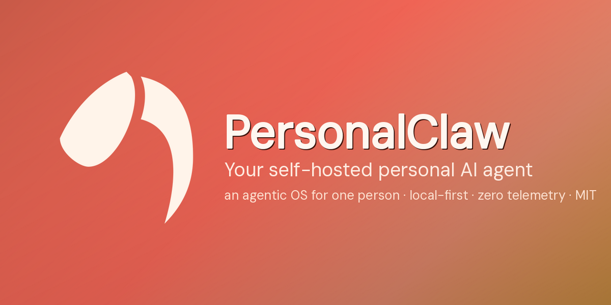
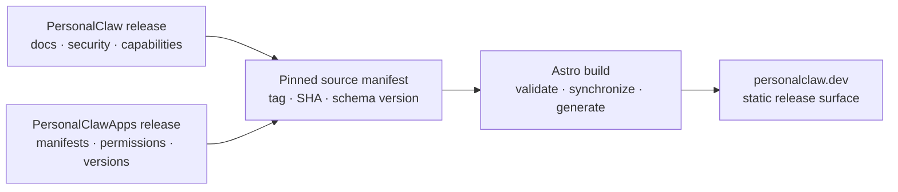

<p align="center">
  
</p>

<h1 align="center">personalclaw.dev</h1>

<p align="center">
  <strong>The public product, documentation, security, installation, and ecosystem surface for PersonalClaw.</strong>
</p>

<p align="center">
  <a href="https://github.com/PersonalClaw/personalclaw.dev/actions/workflows/ci.yml">
    
  </a>
</p>

<p align="center">
  <a href="https://personalclaw.dev">Website</a>
  ·
  <a href="https://github.com/PersonalClaw/PersonalClaw">Core</a>
  ·
  <a href="https://github.com/PersonalClaw/PersonalClawApps">First-party apps</a>
  ·
  <a href="./docs/roadmap/roadmap.md">Roadmap</a>
</p>



## What This Repository Is

This repository contains the source for [personalclaw.dev](https://personalclaw.dev), the public release interface for PersonalClaw.

It has a broader job than a conventional marketing site:

- Show the real product through real, reproducible captures.
- Explain how chat, goal loops, memory, knowledge, automation, and apps fit together.
- Make the ownership, trust, and permission boundaries understandable.
- Publish documentation and installation paths tied to verifiable releases.
- Represent the first-party app ecosystem without duplicating its source of truth.
- Help operators and builders evaluate the project without tracking them.

The website should be persuasive because it is specific and checkable, not because it hides the product's maturity or tradeoffs.

> [!IMPORTANT]
> The current source manifest is explicitly `pre-release`: it pins exact core and apps commits but asserts no tags because neither repository has a tagged release yet. The site identifies this state as a pinned development snapshot. Canonical `/docs` and the production `/install` contract remain roadmap work.

## Experience Map

| Route | Purpose |
|---|---|
| `/` | Product thesis, system overview, ecosystem proof, security posture, and source quickstart |
| `/product` | Guided tour of chat, autonomous goals, memory, knowledge, automation, and agent runtimes |
| `/apps` | Searchable first-party app directory and app-platform explanation |
| `/security` | Trust boundaries, enforced controls, supply-chain lifecycle, and known limitations |
| `/release` | Build channel, exact source commits, package/changelog facts, and manifest-derived ecosystem evidence |

The next major public surfaces are synchronized documentation, release provenance, stable installation, changelog, and app detail routes. Their sequencing and acceptance gates are defined in the [website evolution roadmap](./docs/roadmap/roadmap.md).

## Product Principles

### Show the product

Product captures carry the argument. The site does not use fabricated dashboards, generic AI illustrations, or abstract decoration where an actual interface can explain the capability.

### Publish release truth

Production copy must describe tagged, reproducibly released behavior. Product capabilities, version numbers, security controls, platform support, app metadata, and install methods should be generated or synchronized from their owning repositories.

### Name the boundary

Security language distinguishes enforced controls, work in progress, and documented limitations. Planned hardening is never presented as an existing guarantee.

### Respect the visitor

Zero telemetry is part of the product position. The site has no visitor analytics, session replay, fingerprinting, conversion events, or tracking pixels. Astro's own telemetry is disabled in every repository script.

### Design for inspection

The interface targets WCAG 2.2 AA, keyboard access, 44px touch targets, reduced-motion support, stable responsive media, and readable technical content.

## Technical Architecture

The site is a static Astro application with small React islands only where client-side state is useful.

- **Astro 7** for routing, static rendering, metadata, and responsive image generation.
- **React 19** for the interactive system window, app search, and command copying.
- **TypeScript** across application and component code.
- **Lucide** for interface iconography.
- **Local variable fonts** through Fontsource; no runtime font dependency.
- **Plain CSS and design tokens** for the visual system; no utility framework or component runtime.
- **Playwright Test and Axe** for responsive behavior, accessibility, privacy, keyboard, and visual regression.
- **Lighthouse** for mobile-simulated performance, accessibility, best-practice, SEO, and transfer budgets.



This source flow is active. `sources/personalclaw.sources.json` pins full commits, `scripts/sync-sources.mjs` validates and reads only those revisions, and the ignored `.generated/release-facts.json` artifact feeds the site build. The app directory's descriptions remain curated in `src/data/apps.ts`, but its names and categories are checked against every pinned app manifest so drift fails the build.

## Design Direction

The creative north star is **The Friendly Machine, Seen at Work**.

PersonalClaw is presented as a capable machine working beside one owner in a quiet night studio. Near-black surfaces establish the environment; coral marks action, focus, and active intelligence. The visual system stays warm without becoming ornamental and technical without falling into terminal cosplay.

The complete rationale, token system, interaction rules, responsive behavior, and content voice live in:

- [PRODUCT.md](./PRODUCT.md) for audience, positioning, proof, and product language.
- [DESIGN.md](./DESIGN.md) for visual direction, layout, typography, motion, and component rules.

When implementation and those documents disagree, treat the disagreement as a design decision to resolve, not permission for silent drift.

## Getting Started

### Prerequisites

- Node.js `22.12.0` (the exact CI runtime in `.node-version`)
- npm
- [mise](https://mise.jdx.dev/) recommended for automatic runtime selection

### Local Development

```bash
git clone https://github.com/PersonalClaw/personalclaw.dev.git
cd personalclaw.dev
npm ci
npm run hooks:install
npm run dev
```

Astro serves the site at [http://localhost:4321](http://localhost:4321) by default.

Source synchronization first looks for exact matching sibling checkouts at `../PersonalClaw` and `../PersonalClawApps`. If either checkout is absent, points at another origin, or has a different HEAD, the synchronizer verifies the pinned commit with GitHub and fetches only the required files. `PERSONALCLAW_CORE_DIR` and `PERSONALCLAW_APPS_DIR` can provide explicit checkout paths; explicit mismatches fail instead of falling back.

### Production Build

```bash
npm run build
npm run preview
```

The build runs Astro diagnostics before producing the static site in `dist/`.

## Commands

| Command | What it does |
|---|---|
| `npm run sync:sources` | Validates source pins and generates ignored release facts from exact revisions |
| `npm run dev` | Starts the local Astro development server |
| `npm run check` | Runs Astro and TypeScript diagnostics |
| `npm run build` | Runs diagnostics and creates the production static build |
| `npm run preview` | Serves the production build locally |
| `npm run test:static` | Validates production and preview publication artifacts |
| `npm run test:browser` | Builds and runs the complete Playwright suite |
| `npm run test:lighthouse` | Builds and enforces Lighthouse budgets on every route |
| `npm run test:ci` | Runs the same aggregate quality floor used by CI |
| `npm run test:prepush` | Installs the lockfile and runs the aggregate gate under the exact CI Node runtime |
| `npm run test:visual:update` | Deliberately refreshes committed visual baselines |
| `npm run hooks:install` | Enables the repository-owned pre-push hook |

All scripts set `ASTRO_TELEMETRY_DISABLED=1`.

## Quality Floor

The route contract in `tests/support/site-contract.mjs` is shared by static, browser, and performance gates. A new generated page fails validation until it is added to that contract and receives the same coverage as every existing route.

The required checks are:

- **Static publication contract:** Astro and TypeScript diagnostics, exact route inventory, internal links and fragments, local runtime assets, canonical URLs, descriptions, Open Graph and Twitter metadata, JSON-LD, sitemap, robots policy, explicit image dimensions, tracker signatures, preview `noindex`, and Vercel output/security-header configuration.
- **Browser contract:** every route under desktop, mobile, and reduced-motion projects; Axe WCAG A/AA scans; keyboard-only critical journeys; app query/category URL state; tab behavior; command copy; focus-safe mobile navigation; image loading; horizontal overflow; 44px targets; console/page/request failures; and a same-origin-only network assertion through meaningful interaction states.
- **Visual contract:** committed full-page desktop and mobile baselines for every route plus loop, app-filter, and mobile-menu states.
- **Performance contract:** Lighthouse scores of at least 90 performance and 95 accessibility/best-practices/SEO, with LCP at most 2.5s, CLS at most 0.1, TBT at most 200ms, and explicit page, script, font, and image transfer budgets.

Install the repository's Chromium build once, then run all gates:

```bash
npx playwright install chromium
npm run hooks:install
npm run test:prepush
```

Playwright HTML reports, traces, videos, screenshots from failed tests, and Lighthouse reports are generated locally but ignored. The reviewed visual baselines under `tests/browser/__screenshots__/` are source-controlled.

GitHub Actions exposes three stable jobs that can be required by branch protection: `static-contract`, `browser`, and `performance`. Dependabot checks npm and action updates weekly.

The pre-push hook is a local mirror of those three jobs and is mandatory for this
repository. It starts from `npm ci`, so tests always use the committed lockfile. Do
not use `--no-verify` to bypass it. If a gate is red or cannot run, stop and fix the
gate or its environment before publishing commits. Visual baselines are
platform-qualified for macOS development and Linux CI; update them only after
inspecting the rendered result on the platform that produced it.

## Repository Structure

```text
.
├── .github/             CI workflow and dependency update policy
├── docs/roadmap/        Website evolution and core-plan alignment
├── public/brand/        Public brand mark and social preview
├── scripts/             Artifact and Lighthouse quality gates
├── sources/             Committed source manifest and JSON Schema
├── src/assets/          Product captures optimized by Astro
├── src/components/      Astro components and focused React islands
├── src/data/            Transitional site and app content
├── src/layouts/         Shared document shell and metadata
├── src/pages/           Route entry points
├── src/styles/          Global styles and design tokens
├── tests/browser/       User, accessibility, privacy, and visual coverage
├── tests/support/       Shared public route contract
├── DESIGN.md            Visual and interaction specification
└── PRODUCT.md           Audience, positioning, and product brief
```

## Content And Release Truth

PersonalClaw spans three repositories, with deliberately separate ownership:

| Content | Owning source |
|---|---|
| Product capabilities, version, docs, security posture, and changelog | [PersonalClaw](https://github.com/PersonalClaw/PersonalClaw) |
| First-party app manifests, permissions, requirements, and compatibility | [PersonalClawApps](https://github.com/PersonalClaw/PersonalClawApps) |
| Presentation, public routing, synchronized docs build, and `/install` endpoint | This repository |

Every build pins full source SHAs. The manifest supports two fail-closed channels:

- `pre-release` requires both tags to be `null` and renders a pinned development snapshot.
- `released` requires tags for both repositories, verifies that each tag resolves to its declared SHA, and requires the core tag to match the package version.

The current manifest uses `pre-release` until real core and apps tags exist. Generated files and fetched source caches are ignored; copied source content is never committed to this repository.

Before changing public product copy:

1. Verify the behavior in its owning repository.
2. Determine whether it is shipped, preview, planned, or a documented limitation.
3. Link the claim to canonical documentation or reproducible evidence.
4. Refresh affected captures when the product UI has materially changed.
5. Run the complete quality floor from a visitor's perspective.

Do not commit copied core documentation as an independent source. The planned docs pipeline synchronizes a pinned core checkout into an ignored build workspace.

## Working On The Site

Keep changes narrow and evidence-led:

1. Create a focused branch.
2. Preserve the existing Astro/React boundary; add client JavaScript only for real interaction.
3. Use existing tokens, typography, and layout patterns before introducing new primitives.
4. Import product images through Astro so responsive formats and dimensions remain stable.
5. Validate keyboard behavior, reduced motion, narrow screens, and long text.
6. Run `npm run test:prepush`.
7. Refresh visual baselines only after inspecting and accepting an intentional visual change.

Generated output, dependency directories, and diagnostic reports are intentionally ignored. Reviewed visual baselines are committed.

## Roadmap

The [website evolution roadmap](./docs/roadmap/roadmap.md) coordinates this repository with the PersonalClaw core program. Its immediate direction is:

1. Synchronize canonical docs and machine-readable exports from the pinned core revision.
2. Synchronize security status and limitations.
3. Generate first-party app pages from manifests.
4. Automate launch captures.
5. Publish the one-line installer only after clean-machine distribution gates pass.

The governing rule is simple: **personalclaw.dev should be the clearest projection of released PersonalClaw state, never a competing version of it.**
